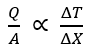
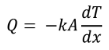
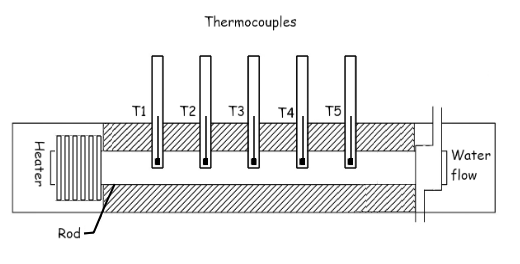
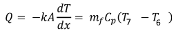
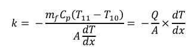

## INTRODUCTION 

Conduction is a process of heat transfer through solids, liquids and gases. When the temperature gradient exists in a body, there is a transfer of heat from the high temperature region to the low temperature region. The heat transfer rate per unit area is proportional to the temperature gradient in the direction of heat flow:  

Where “Q” is the heat transfer in (watts), “A” is the area of heat transfer (m2), ∆T/∆X is the temperature gradient in the direction of heat flow (⁰C/m). Where the proportionality constant is a property of a material and is known as thermal conductivity.  

The positive constant “k” is called the coefficient of thermal conductivity of material. The negative sign indicates that heat transfer takes place in the direction of decreasing temperature. Coefficient of thermal conductivity has the units of W/m ⁰C. Note that the heat flow rate is involved and the numerical value of the coefficient of thermal conductivity indicates how fast heat will flow in each material. Thermal conductivity coefficient is a physical property of the material. Although it is constant in a narrow temperature range, it varies over a wide temperature range. Metals, which are good conductors of heat, have high values of coefficient of thermal conductivity;  
for example, 385 W/m ⁰C for copper. Insulating materials have low values of coefficient of thermal conductivity for example 0.048 W/m⁰C for fiber insulating board. In any conduction heat transfer problem, it is essential to have the knowledge of the coefficient of thermal conductivity of the material involved in the heat transfer process. 
 The experimental setup shown in Fig. 1 has been designed to measure the temperature gradient along the length of the aluminum rod and to determine its coefficient of thermal conductivity. 
  The heater is placed in one end to show unidirectional (axial) heat flow, along the rod and the insulators prevent radial heat loss. Five thermocouples are placed which measures temperature. The opposite end has a cooling water jacket in which water flows at a uniform rate and the rise in temperature of water is noted, to calculate the total heat loss from the rod.   

 
Fig 1. Experimental setup for determining the thermal conductivity of Metal Rod

#### Equations/formulas:

Heat conducted through the rod = heat carried away by the cooling water.

Thus, the thermal conductivity k of metal rod can be evaluated.  

